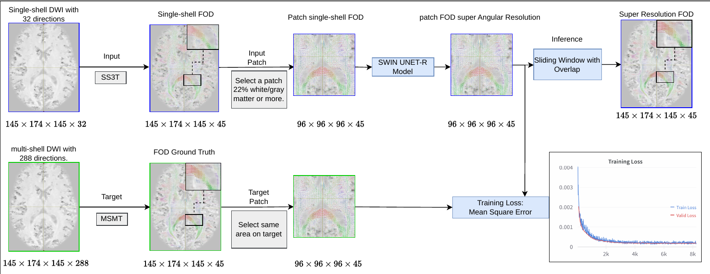

# FOD-Swin-Net

## Description

This README accompanies the submission of the article and includes the following items if the article is accepted:

1. **Training Code**
   The model training can be executed by running the following command:
   ```bash
   python3 main.py configs/swin_purity_patch_96.yaml
   ```
   It is crucial that the training datasets and validation datasets are configured and adjusted to the mempy format; otherwise, the code will not function properly.

2. **Usage Instructions**
   The files that can be used to configure the datasets include `save_mem_map.py`, `save_index_mask.py`, and `save_coordinates_Patches.py`. It is important to pre-configure them to efficiently run the model.

3. **Model Diagram**
   Below is the diagram of our proposed model:

   

4. **Citation**
   If you use this code, please cite our paper:
   ```bibtex
   @article{oliveira2024fod,
     title={FOD-Swin-Net: angular super resolution of fiber orientation distribution using a transformer-based deep model},
     author={Oliveira da Silva, Mateus and Pinheiro Santana, Caio and Santos do Carmo, Diedre and Rittner, Let{\'\i}cia},
     journal={arXiv e-prints},
     pages={arXiv--2402},
     year={2024}
   }
   ```